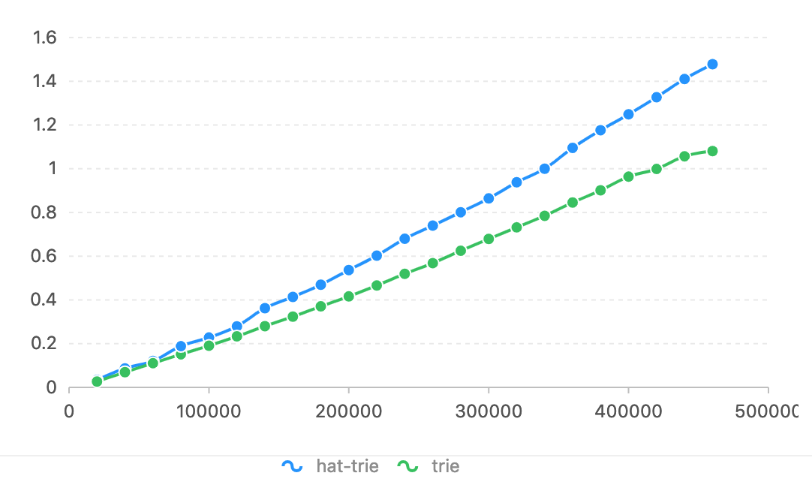
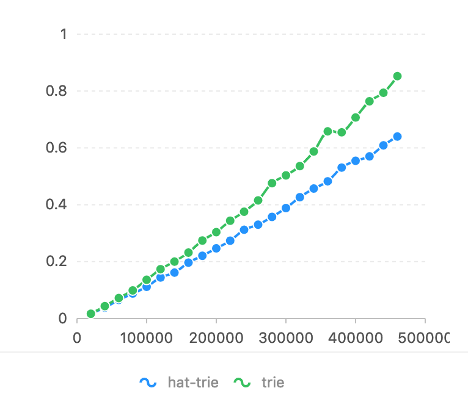
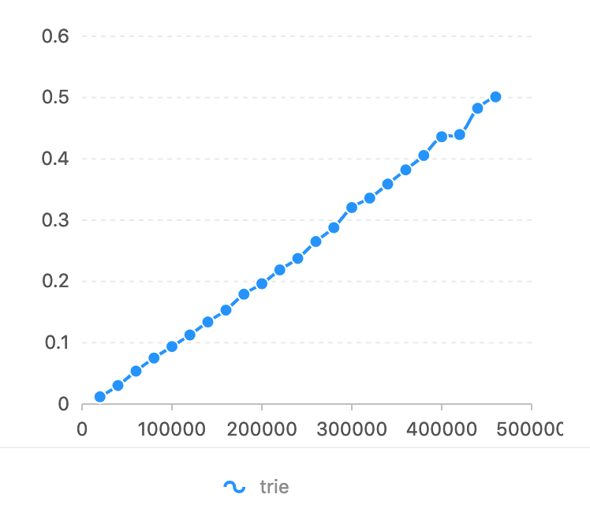
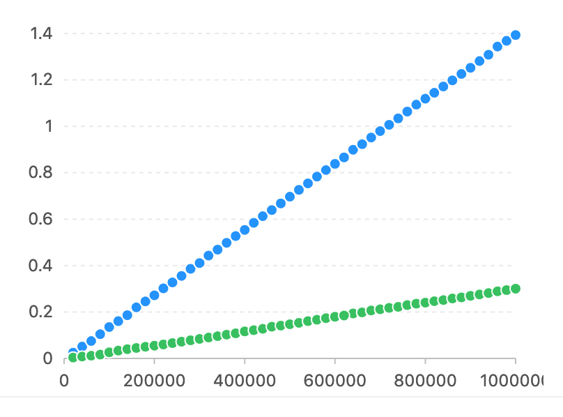
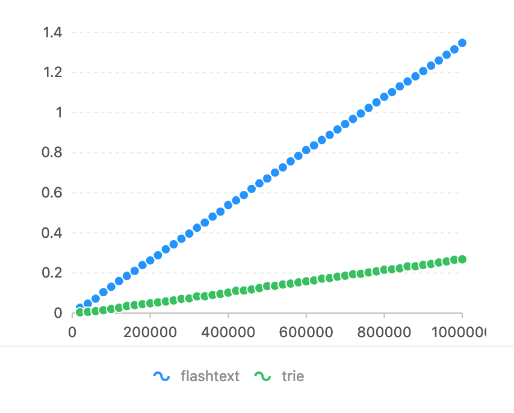
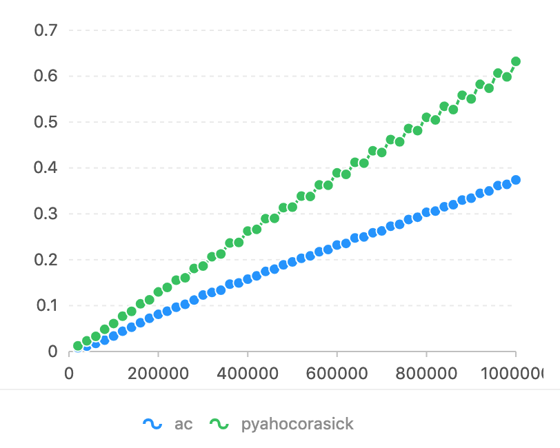

# cyac
[](https://www.python.org/downloads/release/python-270/)
[](https://www.python.org/downloads/release/python-340/)
High performance Trie & Keyword Match & Replace Tool.

It's implemented by cython, and will be compiled to cpp. The trie data structure is cedar, which is an optimized double array trie. it supports Python2.7 and 3.4+. It supports pickle to dump and load.

 If you found this useful please give a star!

# Quick Start
This module is written in cython. You need cython installed.

```
pip install cyac
```

Then create a Trie
```
>>> from cyac import Trie
>>> trie = Trie()
```

add/get/remove keyword
```
>>> trie.insert(u"哈哈") # return keyword id in trie, return -1 if doesn't exist
>>> trie.get(u"哈哈") # return keyword id in trie, return -1 if doesn't exist
>>> trie.remove(u"呵呵") # return keyword in trie
>>> trie[id] # return the word corresponding to the id
>>> trie[u"呵呵"] # similar to get but it will raise exeption if doesn't exist
>>> u"呵呵" in trie # test if the keyword is in trie
```

get all keywords
```
>>> for key, id_ in trie.items():
>>>     print(key, id_)
```

prefix/ predict
```
>>> # return the string in the trie which starts with given string
>>> for id_ in trie.predict(u"呵呵"):
>>>     print(id_)
>>> # return the prefix of given string which is in the trie.
>>> for id_, len_ in trie.prefix(u"呵呵"):
>>>     print(id_, len_)
```

trie extract,replace
```
>>> python_id = trie.insert(u"python")
>>> trie.replace_longest("python", {python_id: u"hahah"}, set([ord(" ")])) # the second parameter is seperator. If you specify seperators. it only matches strings tween seperators. e.g. It won't match 'apython'
>>> for id_, start, end in trie.match_longest(u"python", set([ord(" ")])):
>>>     print(id_, start, end)
```

Aho Corasick extract
```
>>> ac = AC.build([u"python", u"ruby"])
>>> for id, start, end in ac.match(u"python ruby"):
>>>     print(id, start, end)
```


# Performance
On  Ubuntu 14.04.5/Intel(R) Core(TM) i7-4790K CPU @ 4.00GHz. 

## Trie
Compared With HatTrie， Horizon axis is token num. Vertical axis is used time(seconds).
### Insert 


### Get


### Remove


## KeyWord Extract/Replace

Compared With flashText. Regular Expression is too slow in this task (See flashText's bench mark).  Horizon axis is char num to be match. Vertical axis is used time(seconds).




## Aho Corasick Algorithm
Compared With pyahocorasick, Horizon axis is char num to be match. Vertical axis is used time(seconds).


# Unicode

```
>>> len(char.lower()) == len(char) # this is always true in python2, but not in python3
>>> len(u"İstanbul") != len(u"İstanbul".lower()) # in python3
```

In case insensitive matching, this library take care of the fact, and returns correct offset. 

# Run Test
```bash
python setup.py build

PYTHONPATH=$(pwd)/build/BUILD_DST python3 tests/test_all.py
PYTHONPATH=$(pwd)/build/BUILD_DST python3 bench/bench_*.py
```